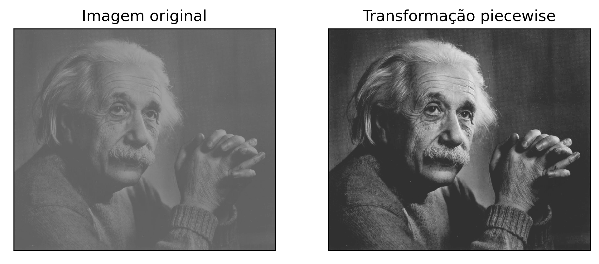
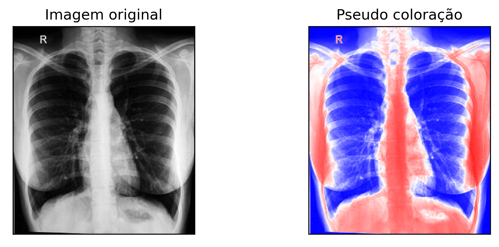

# Exemplo de Transformação Piecewise e Pseudo Coloração
Exemplo desenvolvido na disciplina Processamento Digital de Imagens do Programa de Pós-Graduação em Ciência da Computação (PPGCC) da Universidade Federal do Pará (UFPA) em 2021.1.

    

    

